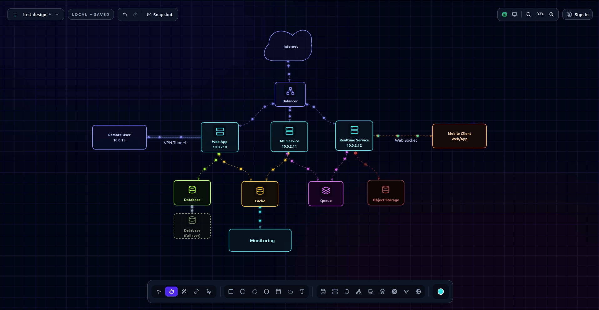

# Toporyx

Initial public release of Toporyx, an open-source topology and system architecture editor for software engineers, cloud architects, and system designers.build with React, Vite, and Firebase.

- Interactive diagram editor
- Local-first diagram persistence
- Firebase authentication
- Cloud synchronization with Firestore
- Production deployment support
- React + Vite based architecture



## Development

```bash
npm install
npm run dev
```

For cloud-enabled local development, create a `.env.local` file from `.env.example` and fill in your Firebase web app values.

## Quality Checks

```bash
npm run lint
npm run test
npm run build
```

## Storage Model

- Signed out: boards are stored in `localStorage` under `toporyx-local`
- Signed in: boards are stored in Firestore under `artifacts/{appId}/users/{uid}/boards/{boardId}`
- First cloud sign-in for an empty user space seeds cloud boards from existing local boards

The app now exposes a small status chip in the top-left HUD so you can tell whether you are in `Local` or `Cloud` mode and whether the latest save is `Saving`, `Saved`, or `Save failed`.

## Environment

Use `.env.example` as the reference for local or production configuration.

This repo no longer ships with a hardcoded Firebase project config. If the required `VITE_FIREBASE_*` variables are missing, the app falls back to local-only mode and disables cloud sync/auth gracefully.

Important variables:

- `VITE_TOPORYX_APP_ID`
- `VITE_FIREBASE_API_KEY`
- `VITE_FIREBASE_AUTH_DOMAIN`
- `VITE_FIREBASE_PROJECT_ID`
- `VITE_FIREBASE_STORAGE_BUCKET`
- `VITE_FIREBASE_MESSAGING_SENDER_ID`
- `VITE_FIREBASE_APP_ID`
- `VITE_FIREBASE_MEASUREMENT_ID`

## Open Source

Toporyx is open source and available for developers, engineers, and system designers who want to create clean topology and system architecture diagrams.

The project is actively maintained, and contributions are welcome. You can help by:

- Reporting bugs
- Suggesting new features
- Improving documentation
- Sharing example diagrams
- Contributing code improvements

If you want to contribute, please open an issue first so we can discuss the idea before implementation.
